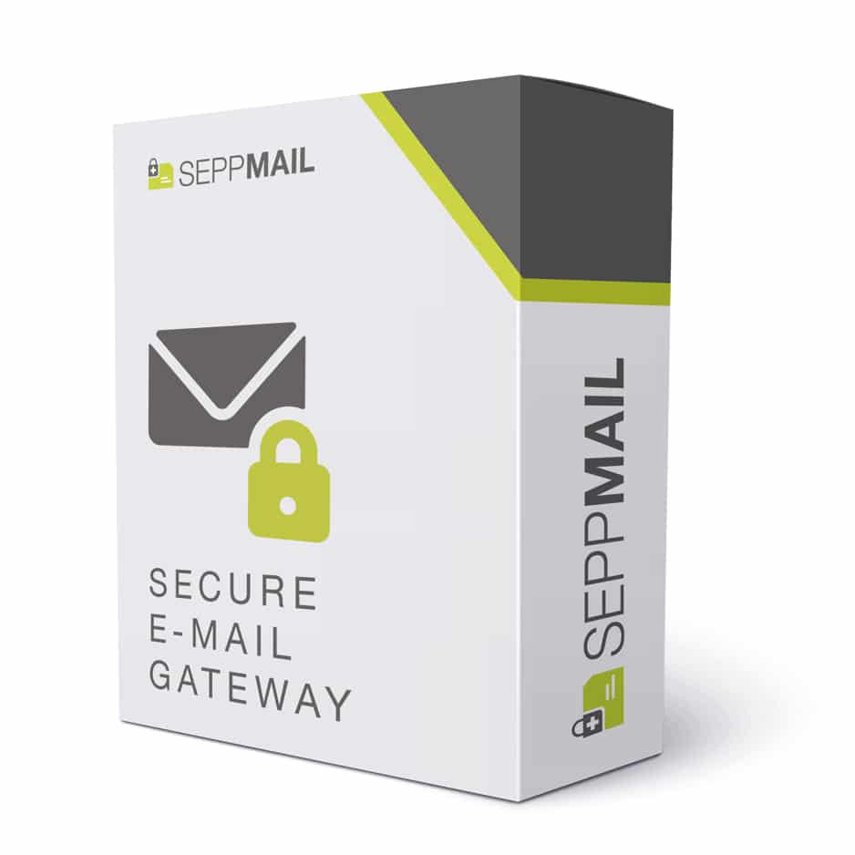
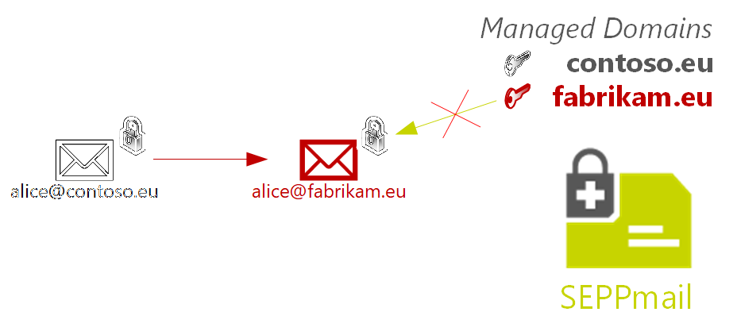
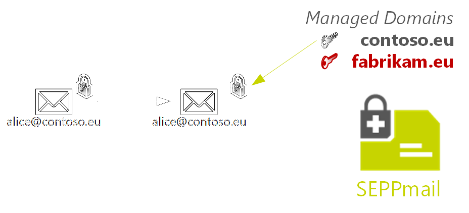

- [Introduction](#introduction)
	- [Changelog.md](#changelogmd)
	- [Abstract](#abstract)
	- [General Note](#general-note)
	- [PowerShell Platform](#powershell-platform)
- [Prerequisites](#prerequisites)
- [Module Installation](#module-installation)
	- [Installation on Windows](#installation-on-windows)
	- [Installation on macOS and Linux](#installation-on-macos-and-linux)
	- [Prereleases](#prereleases)
- [Preparation](#preparation)
- [Setup SEPPmail with Exchange online](#setup-seppmail-with-exchange-online)
	- [1 - Test-SM365ConnectionStatus](#1---test-sm365connectionstatus)
	- [2 - Before you change something](#2---before-you-change-something)
		- [Check existing SEPPmail Rules and Connectors](#check-existing-seppmail-rules-and-connectors)
		- [Generate an Exchange Online Report](#generate-an-exchange-online-report)
		- [Cleanup environment](#cleanup-environment)
		- [Report on Exchange Online Environment](#report-on-exchange-online-environment)
	- [3 - Build Connectivity between Exchange Online and SEPPmail](#3---build-connectivity-between-exchange-online-and-seppmail)
		- [Option 1: FQDN with full SSL and optional "AllowSelfsigned" Option](#option-1-fqdn-with-full-ssl-and-optional-allowselfsigned-option)
		- [Option 1a: Option 1 in an MSP environment](#option-1a-option-1-in-an-msp-environment)
		- [Option 2: FQDN and NoTLS Option](#option-2-fqdn-and-notls-option)
		- [Option 3: IP Option](#option-3-ip-option)
	- [4 - Adding Mailflow-Rules](#4---adding-mailflow-rules)
	- [5 - Controlling SPAM and SEPPmail Appliance handling](#5---controlling-spam-and-seppmail-appliance-handling)
	- [BETA 1.2.5 - Tracing Exchange Online Mailflow with Get-SM365MessageTrace](#beta-125---tracing-exchange-online-mailflow-with-get-sm365messagetrace)
- [Using the Commandlets](#using-the-commandlets)
	- [New-SM365Connectors](#new-sm365connectors)
		- [Default with IP](#default-with-ip)
		- [DNS Check included](#dns-check-included)
		- [Default with FQDN and wildcard certificate](#default-with-fqdn-and-wildcard-certificate)
		- [Default with FQDN and single host SSL certificate](#default-with-fqdn-and-single-host-ssl-certificate)
		- [FQDN with self-signed Certificate](#fqdn-with-self-signed-certificate)
		- [FQDN with no outbound TLS](#fqdn-with-no-outbound-tls)
		- [FQDN with no outbound TLS and DISABLED](#fqdn-with-no-outbound-tls-and-disabled)
		- [Default with FQDN and no ANTISPAM Whitelisting](#default-with-fqdn-and-no-antispam-whitelisting)
	- [Set-SM365Connectors](#set-sm365connectors)
	- [Cleaning Up Connectors](#cleaning-up-connectors)
	- [Final Note on connectors-parameters you can use in **ANY** parameterset](#final-note-on-connectors-parameters-you-can-use-in-any-parameterset)
	- [New-SM365Rules](#new-sm365rules)
	- [Remove-SM365Rules](#remove-sm365rules)
- [Clustering and multi-host configurations](#clustering-and-multi-host-configurations)
- [Upgrading from a previous version](#upgrading-from-a-previous-version)
- [Dealing with aliases and multiple domains in Exchange online](#dealing-with-aliases-and-multiple-domains-in-exchange-online)

# Introduction

## Changelog.md

See updates and changes on the github [ChangeLog.MD](https://github.com/seppmail/SEPPmail365/blob/master/changelog.md) file.

## Abstract

The SEPPmail365 PowerShell module helps customers and partners to smoothly integrate their SEPPmail appliance with Exchange Online.  

Integration with Exchange Online requires the configuration of an inbound and outbound connector to route mails from Exchange Online to the appliance and vice versa, as well as transport rules for necessary mail flow control via X-headers.
  
This module provides means to create and update connectors, rules, and backing up existing configuration, as well as generating a report about the current state of the Exchange Online environment.

## General Note

Please note that Exchange Online is a fast paced environment and subject to change. In pratice that means that a working setup can suddenly stop behaving correctly, as soon as the cloud infrastructure has been updated. This may affect you and thus will require a certain amount of patience.

We try to adapt to these changes ASAP, but can't guarantee that this module will be up to date immediately after Microsoft has deployed new changes.  

## PowerShell Platform

_PowerShell Core is the future !_

*** BREAKING CHANGE *** 

Beginning with version 1.2.5, the module runs only on PowerShell Core on Windows (macOS/Linux in preperation). So install PowerShell Core asap on your machine via the Windows Store or the notes here: https://github.com/powershell/powershell

# Prerequisites

The module requires at least PowerShell Core 7.2 (64bit) and the  
[ExchangeOnlineManagement](https://www.powershellgallery.com/packages/ExchangeOnlineManagement/3.0.0) module of version 3.6.0 or higher.  

The module was developed on Windows 11 and macOS 11.7.

_Note on PowerShell on debian_: There are scenarios where module installation fails with an error on incorrect module manifest. We are currently investigating this. Please try to run it on PowerShell Core on Windows or macOS.

_Note on Windows PowerShell_: Make sure you have the latest version of PowerShellGet installed.

```
Install-Module PowerShellGet -Scope CurrentUser
```

# Module Installation

## Installation on Windows

To installing execute:

```powershell
Install-Module "SEPPmail365"
```

## Installation on macOS and Linux

In addition to the main module you need to add PSWSMan which adds WSMan client libraries to linux and macOS for remote connectivity to Exchange Online.

```powershell
# Do this OUTSIDE Powershell in the shell !
sudo pwsh -command 'Install-Module PSWSMan -Scope allusers' # Read more on this here https://github.com/jborean93/omi
sudo pwsh -Command 'Install-WSMan'
```

## Prereleases

If you want to use the newest version, that might not be production ready
yet, go to the [SEPPmail365 Github repository](https://github.com/seppmail/SEPPmail365), download the source code and execute:  

```powershell
Import-Module "C:\path\to\module\SEPPmail365.psd1"
```

# Preparation

Prior to using this module you need to connect to your Exchange Online organization.  
Use either one of the following commands, depending on whether multi factor  
authentication is enabled for your account or not:  

**Without multi factor authentication:**  

```powershell
Import-Module ExchangeOnlineManagement
$UserCredential = Get-Credential #Enter Exchange Admin UserName and Password
Connect-ExchangeOnline -Credential $UserCredential -ShowProgress $true

# If you have stored your credentials in Secretmanagement it would read:
Connect-ExchangeOnline -Credential (Get-Secret mycredentials) -ShowProgress $true
```

**With multi factor authentication:**  

```powershell
Import-Module ExchangeOnlineManagement
Connect-ExchangeOnline -UserPrincipalName frank@contoso.com -ShowProgress $true
```

**With DEVICE Login:**  

```powershell
Import-Module ExchangeOnlineManagement
# Login to the Exchange Environment with your Web-Browser
Connect-ExchangeOnline -Device
# Follow the instructions.
```


<a id="org003f0ef"></a>

# Setup SEPPmail with Exchange online

Import the Module with:

```powershell
Import-Module SEPPmail365
```

After successful import, this command will also generate am identification-code which is needed for the Appliance setup with Exchange Online.
Remember that code and use it for the appliance setup.

**Note about parameters:**  
All CmdLets support the PowerShell [common parameters](https://docs.microsoft.com/en-us/powershell/module/microsoft.powershell.core/about/about_commonparameters?view=powershell-7) `-Confirm`, `-Whatif`,  
`-Verbose`, etc.  


## 1 - Test-SM365ConnectionStatus

**Synopsis:**  
Internally used to check your connection status to Exchange Online..  

Returns `$true` if you are connected and throws an exception if the connection is not ready.  

**Parameter List:**  
None  

**Examples:**  

```powershell
Test-SM365ConnectionStatus
# returns true/false
```

<a id="orgb92507f"></a>

## 2 - Before you change something

### Check existing SEPPmail Rules and Connectors

```powershell
Get-SM365Rules # Shows existing SEPPmail Rules
Get-SM365Connectors # Shows existing SEPPmail Connectors
```

### Generate an Exchange Online Report

```powershell
New-SM365ExoReport ~\Desktop # generates a report on the desktop
New-SM365ExoReport # generates a report in the users home directory
```

### Cleanup environment

```powershell
Remove-SM365Setup # Removes SEPPmail Rules and Connectors
(Get-HostedConnectionFilterpolicy).IpAllowList # Show existing IP Whitelist
```

### Report on Exchange Online Environment

```powershell
New-SM365ExOReport
```

## 3 - Build Connectivity between Exchange Online and SEPPmail

In this part we create inbound and outbound connectors to allow E-Mail-flow between Exchange Online and SEPPmail. You have several options to establish connectivity.

### Option 1: FQDN with full SSL and optional "AllowSelfsigned" Option

Full SSL is the recommended setting for production environments. All else is for test and demo purposes.

```powershell
New-SM365Connectors [-SEPPmailFQDN] <String> [-TLSCertificateName] <String> [-AllowSelfSignedCertificates] [-NoAntiSpamWhiteList] [-Disabled] [-WhatIf] 
[-Confirm] [<CommonParameters>]
```

### Option 1a: Option 1 in an MSP environment

If you run a customers-enabled SEPPmail appliance and manage multiple customers with multiple managed domains, you need to use certificate-based connectors to ensure that mail-transport from, to an inbetween your Exchange Online tenants works well. Therefor you need a certificate for each managed domain which you can specify with the -CBCcertName paramater.

```powershell
New-SM365Connectors [-SEPPmailFQDN] <String> [-TLSCertificateName] [-CBCCertName] <String> [-Disabled] [-WhatIf] 
[-Confirm] [<CommonParameters>]
```

### Option 2: FQDN and NoTLS Option

If you want that Exchange Online talks to SEPPmail via an FQDN but do not want to use TLS check, use this option.

```powershell
New-SM365Connectors [-SEPPmailFQDN] <String> [-NoOutBoundTlsCheck] [-NoAntiSpamWhiteList] [-Disabled] [-WhatIf] [-Confirm] 
[<CommonParameters>]
```

### Option 3: IP Option

If you want that Exchange Online talks to SEPPmail via an IP-addresss use this option.

```powershell
New-SM365Connectors [-SEPPmailIP] <String> [-NoAntiSpamWhiteList] [-Disabled] [-WhatIf] [-Confirm] [<CommonParameters>]
```

## 4 - Adding Mailflow-Rules

When inbound- and outbound connectors are established, we need mailflow rules to route E-Mails via the SEPPmail appliance if necessary. The New-SM365Rules CmdLet handles this for you. The most convenient way to do this is running the following code:

```powershell
New-SM365Rules -SEPPmailDomain 'contoso.eu','contoso.ch'

# If you want to know what happens in detail, run command with the verbose option

New-SM365Rules -SEPPmailDomain 'contoso.eu','contoso.ch' -Disabled:$false -Verbose

```

## 5 - Controlling SPAM and SEPPmail Appliance handling

When Exchange Online protection of Defender classifies an E-mail it sets a so-called "SCL"-Value. If this happens, wen do not want those e-Mails flow through the SEPPmail Appliance.
Therefor, beginning with version 1.2.5, all SCL-tagged e-mails with value >=5 are excluded from mailflow to SEPPmail.

To change the default value of 5 to 9, use the following example.

```powershell
New-SM365Rules -SEPPmailDomain 'contoso.eu','contoso.ch' -SCLInboundValue 9
```

In rare cases, SEPPmail domain encrypted messages are classified as SPAM. Use the above parameter to adapt your mailflow.

## BETA 1.2.5 - Tracing Exchange Online Mailflow with Get-SM365MessageTrace

Microsoft stores information about the messageflow in TraceLogs and TraceDetailLogs. This logs can be used with the native CmdLets Get-Messagetrace and Get-MessagetraceDetails. For your convenience, we added a CmdLet that does this for you.

You need 2 pieces of data.

The *MessageID* and the *RecipientAddress*, independent if the message is send inbound or outbound. Use:

```powershell
Get-MessageTrace | Select-Object Messageid,RecipientAddress

# This delivers messageids and recipient mailaddresses you can use with the new CmdLet.

Get-SM365MessageTrace -MessageId '4b3a2890-f91b-d781-0308-3447459413fb@domain.com' -Recipient 'someone@fabrikam.com'
```

For more info on the other CmdLets read details below.

# Using the Commandlets

## New-SM365Connectors

**Synopsis:**  
Two connectors are required to route mail flow between the SEPPmail appliance  
and Exchange Online. This CmdLet will create the necessary connectors. 

The CmdLet resolves the SEPPmail-FQDN to check if the DNS entry is correct. **DNS-queries must NOT be done internally**, otherwise internal IP addresses may be used in Exchange Online config settings.

**Examples:**

### Default with IP

```powershell
New-SM365Connectors -SEPPmailIP '20.56.204.137'
Get-SM365Connectors
```

### DNS Check included

```powershell
New-SM365Connectors -SEPPmailFQDN wronghost.contoso.com
# This will raise an error because wronghost.west .... doesnt exist.
Get-SM365Connectors
```

### Default with FQDN and wildcard certificate

```powershell
New-SM365Connectors -SEPPmailFQDN securemail.contoso.com -TLSCertificatename '*.contoso.com'
Get-SM365Connectors # Shows DomainValidation
```

### Default with FQDN and single host SSL certificate

```powershell
New-SM365Connectors -SEPPmailFQDN securemail.contoso.com
# Creates the connector using securemail.contoso.com as TLSCertificatename
Get-SM365Connectors # Shows DomainValidation
```

### FQDN with self-signed Certificate

```powershell
New-SM365Connectors -SEPPmailFQDN securemail.contoso.com -AllowSelfSignedCertificates
New-SM365Connectors -SEPPmailFQDN securemail.contoso.com -TLSCertificatename '*.contoso.com' -AllowSelfSignedCertificates
Get-SM365Connectors # Shows EncryptionOnly
```

### FQDN with no outbound TLS

```powershell
New-SM365Connectors -SEPPmailFQDN securemail.contoso.com -NoOutBoundTlsCheck
Get-SM365Connectors # Shows NO Tls
```

### FQDN with no outbound TLS and DISABLED

```powershell
New-SM365Connectors -SEPPmailFQDN securemail.contoso.com -NoOutBoundTlsCheck -disabled
Get-SM365Connectors #Shows disabled
```

### Default with FQDN and no ANTISPAM Whitelisting

```powershell
New-SM365Connectors -SEPPmailFQDN securemail.contoso.com -NoAntiSpamWhiteListing
(Get-HostedConnectionFilterPolicy).IpAllowList # Show IP Whitelist
Get-SM365Connectors
```

## Set-SM365Connectors

**Synopsis:**  
This CmdLet is **an alias** for New-SM365Connectors. This was an active design decision to bring all the logic of connector functionality into one commandlet. If you need to adapt existing connectors, use either the web interface or the native Exchange Online CmdLets Set-InboundConnector or Set-OutBoundConnector.

## Cleaning Up Connectors

```powershell
Remove-SM365Connector -LeaveAntiSpamWhiteList
(Get-HostedConnectionFilterpolicy).IpAllowList # Show IP Whitelist
# or
Remove-SM365Connector # Cleans up IP Adresses from hosted connection filter policy
```

## Final Note on connectors-parameters you can use in **ANY** parameterset

```powershell
-disabled # Is be used to create "disabled" connectors. Makes sense for sensitive environment with step-by-step implementation.

-NoAntiSpamWhiteListing # Is used to disable whitelisting
```

**Note on Disable/enable:** To enable the connectors, either recreate them, use the admin interface of Exchange Online or use the native Exchange Online PowerShell CmdLets `Set-InboundConnector` and `Set-OutBoundConnector`.

## New-SM365Rules

**Synopsis:**  
Creates the required transport rules needed to correctly handle mails from and to the SEPPmail appliance.  

!Important: Beginning with Version 1.2.5, rules are created DISABLED by default. We did this for smoother integration in production environments. You may create them enabled with the -Disabled:$false switch on creation.

**Parameter List:**  
`-PlacementPriority`  
Specifies whether new rules should be put in front or behind existing transport rules (if any). If not provided and in an interactive session, the CmdLet will ask for this information interactively.  

`-SEPPmailDomain [String[]] (Mandatory)`  
Specifies one or more (comma-seperated) E-Mail domains that will be include in SEPPmail cryptographic management. 

`-Disabled [Switch] (optional)`  
Allows for the rules to be created in an active state, in case you want to activate them immediately.  

**Examples:**  

```powershell
New-SM365Rules -SEPPmailDomain 'contoso.ch','contoso.de'
```

```powershell
# Create the transport rules in an active state
New-SM365Rules -SEPPmailDomain 'contoso.ch','contoso.de' -disabled:$false
```

## Remove-SM365Rules

**Synopsis:**  
Removes the SEPPmail transport rules.  

**Examples:**  

```powershell
Remove-SM365Rules
```

# Clustering and multi-host configurations

The current version only supports the usage of one SEPPmail per Connector-command. This might be an SMTP load-balancer for a cluster or a single node. If you want to use multiple hosts for Exchange Online-SEPPmail connectivity, create the connectors with one host and add the others in the UI or PowerShell CmdLets "Set-OutboundConnector" and "Set-InboundConnector". Furthermore adapt the Anti-SPAM Whitelist with "Set-HostedConnectionFilterPolicy".

# Upgrading from a previous version

1.) Optionally Backup Connectors and Rules with native ExchangeOnlineManagement Module commands

2.) Uninstall old SEPPMail365 Module "uninstall-module SEPPmail365"

3.) Install newest module with "Install-Module SEPPmail365"

4.) Remove SEPPmail Transport-Rules "Remove-SM365rules"

5.) Remove SEPPmail Connectors "Remove-SM365Connectors"

6.) Create Connectors "New-SM365Connectors"

7.) Create Rules "New-SM365Rules -SEPPmailDomain 'fabrikam.eu'

# Dealing with aliases and multiple domains in Exchange online

Exchange Online has the unpleasent behavior to rename e-mail addresses when somebody sends an E-mail to an alias. This prevents E-mail decryption in many ways, i.e. the SEPPmail domain encryption, and others. What happens is that the private decryption keys for the re-written alias adressess do not fit anymore as in the picture below.



Beginning with 2022, Microsoft has announced a beta-feature for Exchange Online which does not rewrite domains anymore. The feature is in public preview and can be activated very simply with the following command:

```powershell
Set-OrganizationConfig -SendFromAliasEnabled $TRUE
```

This setting prevents the alias-rewrite step and allows it for SEPPmail to use the correct keys for decryption.



For more info read the original [blog from Microsoft](https://techcommunity.microsoft.com/t5/exchange-team-blog/sending-from-email-aliases-public-preview/ba-p/3070501).

--- end of file ---
